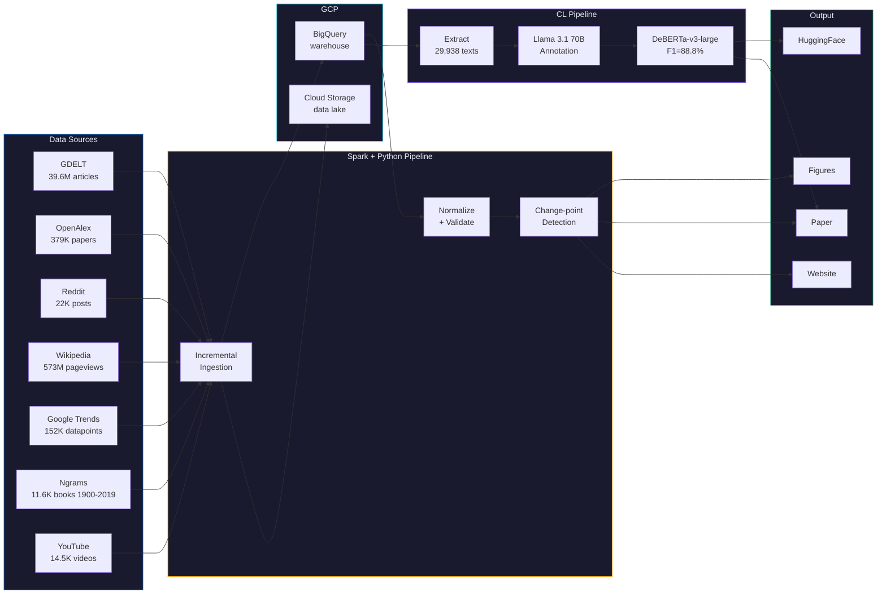

<p align="center">
  
</p>

<h1 align="center">KYIV <sub>NOT</sub> <s>KIEV</s></h1>

<p align="center">
  <strong>#KyivNotKiev: A Large-Scale Computational Study of Ukrainian Toponym Adoption</strong><br>
  613M+ records, 55 toponym pairs, 7 sources, transformer-based discourse analysis.
</p>

<p align="center">
  <a href="https://kyivnotkiev.org">kyivnotkiev.org</a>
</p>

---

| Metric | Value |
|--------|-------|
| Records analyzed | **613M+** (39.6M news articles, 573M pageviews, 152K trends, 22K posts, 14.5K videos, 11.6K ngrams, 379K papers) |
| Toponym pairs | **55** enabled across **8** categories |
| Data sources | **7** (GDELT, Google Trends, Wikipedia, Reddit, YouTube, Google Books Ngrams, OpenAlex) |
| CL corpus | **29,938** texts, DeBERTa-v3-large F1=88.8% |
| Time span | **2010--2026** (Ngrams: 1900--2019) |
| Countries | **55** with per-country adoption data |
| Infrastructure | **GCP** (BigQuery, Dataproc/Spark, GCS, Cloud Run) |
| Reproducibility | `make reproduce` -- one command, full pipeline |

## Architecture



## Quick Start

```bash
uv sync
make infra
make reproduce
```

## Key Commands

| Command | What it does |
|---------|-------------|
| `make ingest` | Incremental ingestion -- skips fresh pairs |
| `make ingest-pair ID=1` | Ingest one pair across all sources |
| `make analyze` | All analysis: adoption, changepoints, regression, holdouts |
| `make figures` | Generate publication figures from BigQuery |
| `make cl-all` | Full CL pipeline: extract, balance, classify, finetune, export |
| `make status` | Show watermarks -- what's been fetched |
| `make reproduce` | Full end-to-end reproduction |

See also: [pipeline/README.md](pipeline/README.md) | [pipeline/cl/README.md](pipeline/cl/README.md) | [infrastructure/README.md](infrastructure/README.md) | [dataset/README.md](dataset/README.md)

## Citation

```bibtex
@article{dobrovolskyi2026kyivnotkiev,
  title={{#KyivNotKiev}: A Large-Scale Computational Study of Ukrainian Toponym Adoption},
  author={Dobrovolskyi, Ivan},
  year={2026}
}
```
