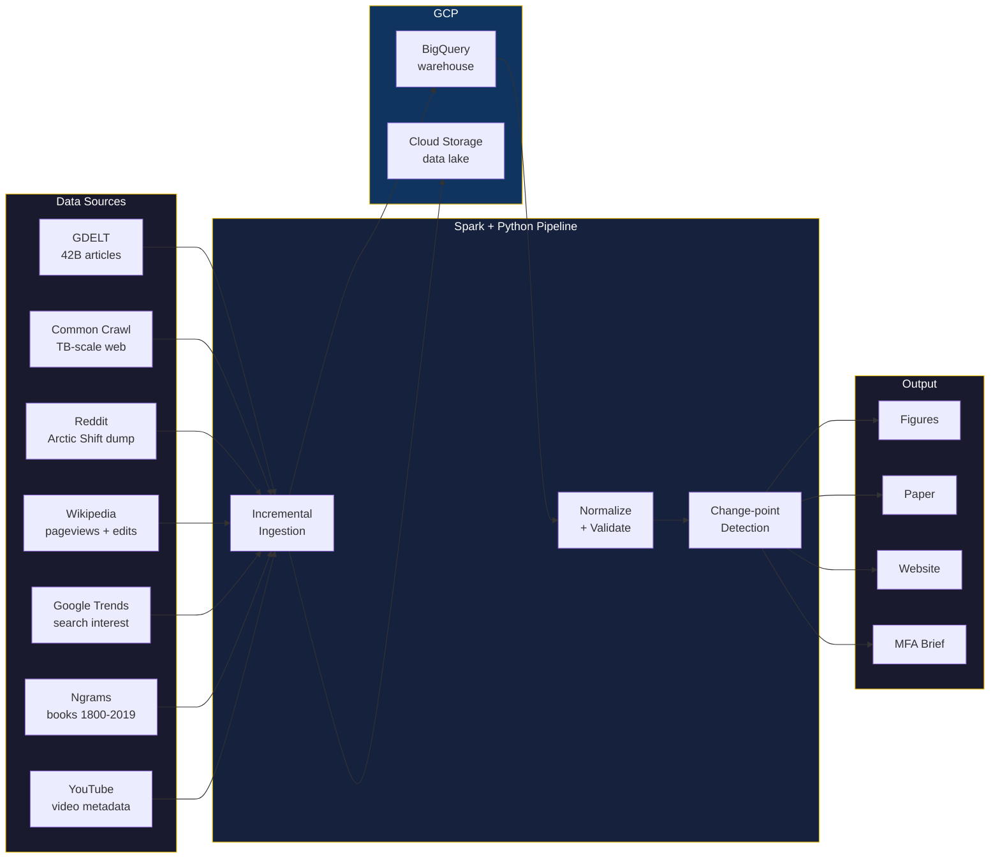

```
██╗  ██╗██╗   ██╗██╗██╗   ██╗    ███╗   ██╗ ██████╗ ████████╗    ██╗  ██╗██╗███████╗██╗   ██╗
██║ ██╔╝╚██╗ ██╔╝██║██║   ██║    ████╗  ██║██╔═══██╗╚══██╔══╝    ██║ ██╔╝██║██╔════╝██║   ██║
█████╔╝  ╚████╔╝ ██║██║   ██║    ██╔██╗ ██║██║   ██║   ██║       █████╔╝ ██║█████╗  ██║   ██║
██╔═██╗   ╚██╔╝  ██║╚██╗ ██╔╝    ██║╚██╗██║██║   ██║   ██║       ██╔═██╗ ██║██╔══╝  ╚██╗ ██╔╝
██║  ██╗   ██║   ██║ ╚████╔╝     ██║ ╚████║╚██████╔╝   ██║       ██║  ██╗██║███████╗ ╚████╔╝
╚═╝  ╚═╝   ╚═╝   ╚═╝  ╚═══╝      ╚═╝  ╚═══╝ ╚═════╝    ╚═╝       ╚═╝  ╚═╝╚═╝╚══════╝  ╚═══╝
```

**Computational analysis of Ukrainian toponym adoption across 1.5B+ mentions from 7 sources.**

Big data pipeline tracking how the world adopts Ukrainian spellings — from Kyiv to Borshch — using Apache Spark on Google Cloud.

---

| Metric | Value |
|--------|-------|
| Toponym pairs | **71** (69 enabled) |
| Categories | **8** (geographical, food, landmarks, country, institutional, sports, historical, people) |
| Data sources | **7** (GDELT, Common Crawl, Reddit, Wikipedia, Google Trends, Ngrams, YouTube) |
| Time span | **2004–2026** |
| Infrastructure | **GCP** (BigQuery, Dataproc/Spark, GCS, Cloud Run) |
| Reproducibility | `make reproduce` — one command, full pipeline |

## Architecture



## Quick Start

```bash
# Install
uv sync

# Deploy GCP infrastructure
make infra

# Run full pipeline
make reproduce

# Or step by step:
make ingest          # Fetch data (incremental)
make preprocess      # Normalize
make analyze         # Change-point detection, regression, holdout analysis
make figures         # Generate all charts
```

## Key Commands

| Command | What it does |
|---------|-------------|
| `make ingest` | Incremental ingestion — skips fresh pairs |
| `make ingest-pair ID=1` | Ingest one pair across all sources |
| `make ingest-common-crawl` | Spark job on Dataproc (TB-scale) |
| `make analyze` | All analysis: adoption, changepoints, regression, holdouts |
| `make figures` | Generate publication figures from BigQuery |
| `make status` | Show watermarks — what's been fetched |
| `make reproduce` | Full end-to-end reproduction |

## Adding a New Pair

Edit `config/pairs.yaml`:

```yaml
- id: 72
  category: food
  russian: "Pelmeni"
  ukrainian: "Varenyky"
  enabled: true
  is_control: false
```

Run `make ingest-pair ID=72`. Done. Existing data untouched.

## Project Structure

```
config/           → pairs.yaml, sources.yaml, pipeline.yaml
infrastructure/   → Terraform (BigQuery, GCS, Dataproc, IAM)
pipeline/
  ingestion/      → GDELT, Common Crawl, Reddit, Wikipedia, Trends, Ngrams, YouTube
  analysis/       → adoption, changepoint, categories, holdouts, regression
  figures/        → crossover, heatmap, choropleth, category curves
  transform/      → normalize, validate, watermarks
tests/
Dockerfile        → Full reproducible environment
Makefile          → One-command everything
```

## Research

Academic paper in preparation. See [KyivNotKiev-paper](https://github.com/IvanDobrovolsky/KyivNotKiev-paper).
