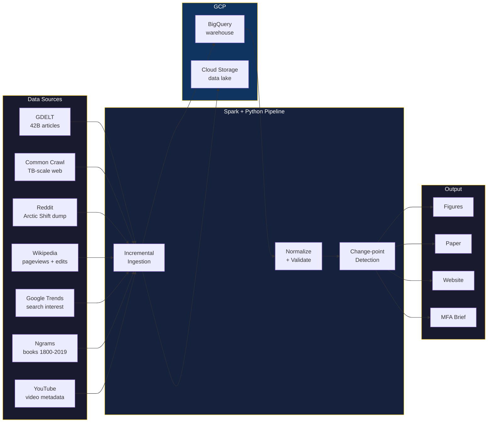

<p align="center">
  
</p>

<h1 align="center">KYIV <sub>NOT</sub> <s>KIEV</s></h1>

<p align="center">
  <strong>#KyivNotKiev: A Large-Scale Computational Study of Ukrainian Toponym Adoption</strong><br>
  613M+ records, 55 toponym pairs, 7 sources, transformer-based discourse analysis.
</p>

<p align="center">
  <a href="https://kyivnotkiev.org">kyivnotkiev.org</a>
</p>

---

| Metric | Value |
|--------|-------|
| Records analyzed | **613M+** (39.6M news articles, 573M page views, 22K posts, 14.5K videos, 379K academic papers) |
| Data processed | **~1.2 PB** |
| Toponym pairs | **55** enabled across **8** categories |
| Data sources | **7** (Google Trends, GDELT, Wikipedia, Reddit, YouTube, Google Books Ngrams, OpenAlex) |
| Time span | **2010–2026** (Ngrams: 1900–2019) |
| Countries | **55** with per-country adoption data |
| Infrastructure | **GCP** (BigQuery, Dataproc/Spark, GCS, Cloud Run) |
| Reproducibility | `make reproduce` — one command, full pipeline |

## Architecture



## Quick Start

```bash
# Install
uv sync

# Deploy GCP infrastructure
make infra

# Run full pipeline
make reproduce

# Or step by step:
make ingest          # Fetch data (incremental)
make preprocess      # Normalize
make analyze         # Change-point detection, regression, holdout analysis
make figures         # Generate all charts
```

## Key Commands

| Command | What it does |
|---------|-------------|
| `make ingest` | Incremental ingestion — skips fresh pairs |
| `make ingest-pair ID=1` | Ingest one pair across all sources |
| `make ingest-common-crawl` | Spark job on Dataproc (TB-scale) |
| `make analyze` | All analysis: adoption, changepoints, regression, holdouts |
| `make figures` | Generate publication figures from BigQuery |
| `make status` | Show watermarks — what's been fetched |
| `make reproduce` | Full end-to-end reproduction |

## Project Structure

```
config/             → pairs.yaml, sources.yaml, pipeline.yaml
infrastructure/     → Terraform (BigQuery, GCS, Dataproc, IAM) — see infrastructure/README.md
pipeline/           → Data pipeline — see pipeline/README.md
  ingestion/        → GDELT, Common Crawl, Reddit, Wikipedia, Trends, Ngrams, YouTube
  analysis/         → adoption, changepoint, categories, holdouts, regression
  figures/          → crossover, heatmap, choropleth, category curves
  transform/        → normalize, validate, watermarks
website/            → kyivnotkiev.org static site
tests/
Dockerfile          → Full reproducible environment
Makefile            → One-command everything
```

## Citation

```bibtex
@article{dobrovolskyi2026kyivnotkiev,
  title={{#KyivNotKiev}: A Large-Scale Computational Study of Ukrainian Toponym Adoption},
  author={Dobrovolskyi, Ivan},
  year={2026}
}
```
