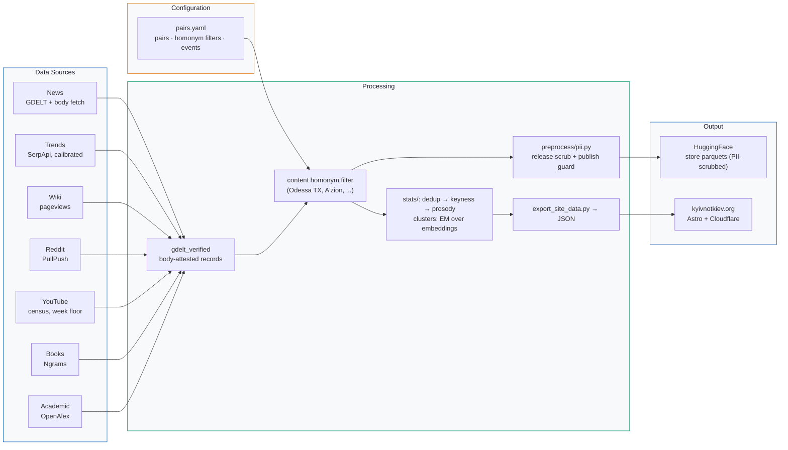

<p align="center">
  
</p>

<h1 align="center">#KyivNotKiev</h1>

<p align="center">
  <strong>A Computational Study of Ukrainian Toponym Adoption</strong><br>
  Multi-source data analysis and machine learning across 7 independent sources, 2010–2025.
</p>

<p align="center">
  <a href="https://kyivnotkiev.org">kyivnotkiev.org</a> ·
  <a href="https://huggingface.co/datasets/KyivNotKiev/toponym-adoption-data">Dataset</a> ·
  <a href="https://www.bbc.com/ukrainian/news-45718643">BBC Coverage</a>
</p>

---

<!-- AUTO:metrics -->
| Metric | Value |
|--------|-------|
| Records scanned | **—** |
| Toponym matches | **1.5M** |
| Toponym pairs | **24** |
| Data sources | **7** |
| Time span | **2010-2025** |
| CL corpus | **151.6K** verified English texts |
<!-- /AUTO:metrics -->

> Numbers above and in the source table are generated from `site/src/data/manifest.json`
> by `pipeline/update_readme.py`. Do not edit them by hand — run `python -m pipeline.rebuild`.

## Scope

The study deliberately tracks a **small set of pairs in depth** rather than a large set
shallowly. Pairs are enabled or disabled in [`config/pairs.yaml`](config/pairs.yaml), which is
the single source of truth: every derived artifact — statistics, site JSON, this README — is
regenerated from it.

Pairs are excluded when the spelling variants are too ambiguous to attribute reliably
(for example, a Russian form that is also a common English word or an unrelated place name).
An unverifiable measurement is dropped rather than reported with a caveat.

## Data Sources

<!-- AUTO:sources -->
| Source | Records | Pairs | Description |
|--------|---------|-------|-------------|
| Wiki | 298.7M | 24 | Wikipedia · monthly |
| Reddit | 840.2K | 24 | 44766 subreddits |
| YouTube | 351.3K | 12 | 136634 channels |
| News | 316.4K | 22 | GDELT · 9267 domains |
| Trends | 113.8K | 24 | Google · 150 countries |
| Academic | 30.7K | 18 | OpenAlex · 250M+ works |
| Books | 897 | 21 | Google Books · 8M+ volumes |
<!-- /AUTO:sources -->

All source data is on HuggingFace: [`KyivNotKiev/toponym-adoption-data`](https://huggingface.co/datasets/KyivNotKiev/toponym-adoption-data)

## Pipeline


```mermaid
graph LR
    subgraph Sources["Data Sources"]
        style Sources fill:#f8f9fb,stroke:#0057B8,color:#1a1a2e
        GDELT["News<br/>GDELT + body fetch"]
        Trends["Trends<br/>SerpApi, calibrated"]
        Wiki["Wiki<br/>pageviews"]
        Reddit["Reddit<br/>PullPush"]
        YT["YouTube<br/>census, week floor"]
        Ngrams["Books<br/>Ngrams"]
        OA["Academic<br/>OpenAlex"]
    end

    subgraph Config["Configuration"]
        style Config fill:#f8f9fb,stroke:#d97706,color:#1a1a2e
        Pairs["pairs.yaml<br/>pairs · homonym filters · events"]
    end

    subgraph Processing["Processing"]
        style Processing fill:#f8f9fb,stroke:#059669,color:#1a1a2e
        Verify["gdelt_verified<br/>body-attested records"]
        Homonym["content homonym filter<br/>(Odessa TX, A'zion, ...)"]
        PII["preprocess/pii.py<br/>release scrub + publish guard"]
        Stats["stats/: dedup → keyness → prosody<br/>clusters: EM over embeddings"]
        Export["export_site_data.py → JSON"]
    end

    subgraph Output["Output"]
        style Output fill:#f8f9fb,stroke:#0057B8,color:#1a1a2e
        HF["HuggingFace<br/>store parquets (PII-scrubbed)"]
        Site["kyivnotkiev.org<br/>Astro + Cloudflare"]
    end

    GDELT & Trends & Wiki & Reddit & YT & Ngrams & OA --> Verify
    Pairs --> Homonym
    Verify --> Homonym --> Stats --> Export --> Site
    Homonym --> PII --> HF
```

Key entry points: `pipeline.build_youtube_census` (adaptive-depth census),
`pipeline.build_gdelt_verified` (body-verified news records),
`pipeline.merge_browser_refetch` (paywalled-article recovery),
`pipeline.stats.analyze_pair` / `pipeline.stats.clusters` (per-pair statistics),
`pipeline.preprocess.pii` (release scrubbing), `pipeline.store.migrate` / `publish`
(HuggingFace mirror). Telegram was collected once and deprecated (Cyrillic-dominated,
not international English); its raw file ships as `deprecated_telegram_raw.parquet`.

## Rebuilding

One command regenerates every derived artifact from the dataset parquets and `config/pairs.yaml`:

```bash
python -m pipeline.rebuild
```

It validates the dataset parquets, exports the site JSON, prunes any disabled pair from every
site file, refreshes this README, and verifies that all site data agrees with
`config/pairs.yaml` — failing if it does not. Final statistical estimates (hierarchical
Bayesian adoption curves) ship with the paper, not this repo.

Then build and deploy the site:

```bash
cd site && npm run build
```

## Citation

```bibtex
@article{dobrovolskyi2026kyivnotkiev,
  title={{#KyivNotKiev}: A Computational Study of Ukrainian Toponym Adoption},
  author={Dobrovolskyi, Ivan},
  year={2026}
}
```
