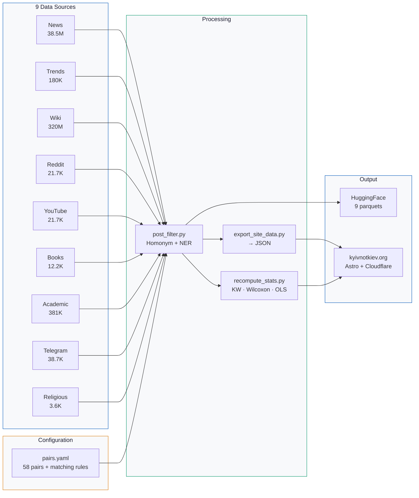

<p align="center">
  
</p>

<h1 align="center">#KyivNotKiev</h1>

<p align="center">
  <strong>A Large-Scale Computational Study of Ukrainian Toponym Adoption</strong><br>
  Large-scale data analysis and machine learning across 9 independent sources.
</p>

<p align="center">
  <a href="https://kyivnotkiev.org">kyivnotkiev.org</a> ·
  <a href="https://huggingface.co/datasets/KyivNotKiev/toponym-adoption-data">Dataset</a> ·
  <a href="https://www.bbc.com/ukrainian/news-45718643">BBC Coverage</a>
</p>

---

| Metric | Value |
|--------|-------|
| Records scanned | **90B+** |
| Toponym matches | **359M** |
| Toponym pairs | **58** |
| Data sources | **9** (News, Trends, Wiki, Reddit, YouTube, Books, Academic, Telegram, Religious) |
| Time span | **2010–2026** (Books: 2000–2022) |
| FP rate | **0.9%** (verified on 19,250 samples) |
| CL corpus | **93K** verified English texts |

## Data Sources

| Source | Records | Description |
|--------|---------|-------------|
| News (GDELT) | 38.5M | URL-level toponym matching in global news articles |
| Trends | 180K | Google search interest across 55 countries |
| Wiki | 320M | Wikipedia pageviews for spelling-variant redirects |
| Reddit | 21.7K | Posts and comments from r/ukraine, r/worldnews, r/europe |
| YouTube | 21.7K | Video titles and descriptions |
| Books (Ngrams) | 12.2K | Google Books corpus 37 (English 2022) |
| Academic (OpenAlex) | 381K | Scholarly paper titles and abstracts |
| Telegram | 38.7K | Public channel messages (177 channels, 118-term systematic search) |
| Religious | 3.6K | Moscow Patriarchate, WCC, Constantinople, Vatican press |

All source data is on HuggingFace: [`KyivNotKiev/toponym-adoption-data`](https://huggingface.co/datasets/KyivNotKiev/toponym-adoption-data)

## Pipeline


```mermaid
graph LR
    subgraph Sources["9 Data Sources"]
        style Sources fill:#f8f9fb,stroke:#0057B8,color:#1a1a2e
        GDELT["News<br/>38.5M"]
        Trends["Trends<br/>180K"]
        Wiki["Wiki<br/>320M"]
        Reddit["Reddit<br/>21.7K"]
        YT["YouTube<br/>21.7K"]
        Ngrams["Books<br/>12.2K"]
        OA["Academic<br/>381K"]
        TG["Telegram<br/>38.7K"]
        Rel["Religious<br/>3.6K"]
    end

    subgraph Config["Configuration"]
        style Config fill:#f8f9fb,stroke:#d97706,color:#1a1a2e
        Pairs["pairs.yaml<br/>58 pairs + matching rules"]
    end

    subgraph Processing["Processing"]
        style Processing fill:#f8f9fb,stroke:#059669,color:#1a1a2e
        PostFilter["post_filter.py<br/>Homonym + NER"]
        Export["export_site_data.py<br/>→ JSON"]
        Stats["recompute_stats.py<br/>KW · Wilcoxon · OLS"]
    end

    subgraph Output["Output"]
        style Output fill:#f8f9fb,stroke:#0057B8,color:#1a1a2e
        HF["HuggingFace<br/>9 parquets"]
        Site["kyivnotkiev.org<br/>Astro + Cloudflare"]
    end

    GDELT & Trends & Wiki & Reddit & YT & Ngrams & OA & TG & Rel --> PostFilter
    Pairs --> PostFilter
    PostFilter --> Export --> Site
    PostFilter --> Stats --> Site
    PostFilter --> HF
```

## Citation

```bibtex
@article{dobrovolskyi2026kyivnotkiev,
  title={{#KyivNotKiev}: A Large-Scale Computational Study of Ukrainian Toponym Adoption},
  author={Dobrovolskyi, Ivan},
  year={2026}
}
```
