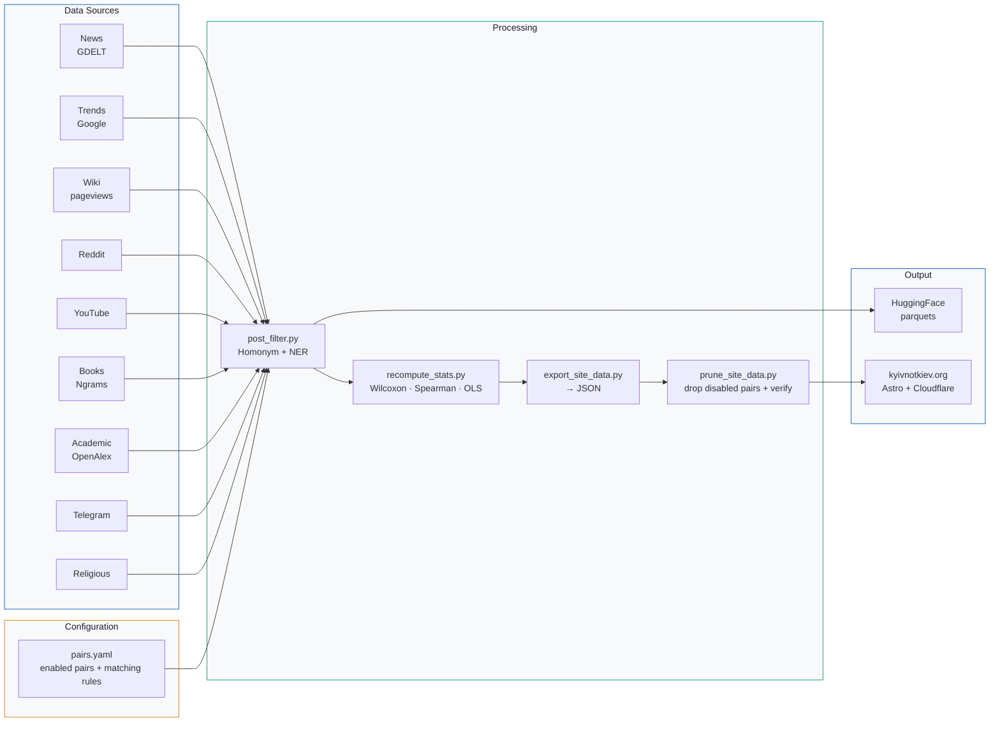

<p align="center">
  
</p>

<h1 align="center">#KyivNotKiev</h1>

<p align="center">
  <strong>A Computational Study of Ukrainian Toponym Adoption</strong><br>
  Multi-source data analysis and machine learning across 9 independent sources.
</p>

<p align="center">
  <a href="https://kyivnotkiev.org">kyivnotkiev.org</a> ·
  <a href="https://huggingface.co/datasets/KyivNotKiev/toponym-adoption-data">Dataset</a> ·
  <a href="https://www.bbc.com/ukrainian/news-45718643">BBC Coverage</a>
</p>

---

<!-- AUTO:metrics -->
| Metric | Value |
|--------|-------|
| Records scanned | **90B+** |
| Toponym matches | **319.9M** |
| Toponym pairs | **22** |
| Data sources | **9** |
| Time span | **2010-2025** |
| CL corpus | **151.6K** verified English texts |
<!-- /AUTO:metrics -->

> Numbers above and in the source table are generated from `site/src/data/manifest.json`
> by `pipeline/update_readme.py`. Do not edit them by hand — run `python -m pipeline.rebuild`.

## Scope

The study deliberately tracks a **small set of pairs in depth** rather than a large set
shallowly. Pairs are enabled or disabled in [`config/pairs.yaml`](config/pairs.yaml), which is
the single source of truth: every derived artifact — statistics, site JSON, this README — is
regenerated from it.

Pairs are excluded when the spelling variants are too ambiguous to attribute reliably
(for example, a Russian form that is also a common English word or an unrelated place name).
An unverifiable measurement is dropped rather than reported with a caveat.

## Data Sources

<!-- AUTO:sources -->
| Source | Records | Pairs | Description |
|--------|---------|-------|-------------|
| Wiki | 298.7M | 22 | Wikipedia · monthly |
| News | 20.1M | 22 | GDELT · 33091 domains |
| Reddit | 840.2K | 21 | 44766 subreddits |
| Trends | 113.4K | 22 | Google · 150 countries |
| YouTube | 35.4K | 6 | 21984 channels |
| Academic | 30.7K | 16 | OpenAlex · 250M+ works |
| Telegram | 25.6K | 9 | 125 channels |
| Religious | 3.4K | 7 | 4 institutions |
| Books | 897 | 18 | Google Books · 8M+ volumes |
<!-- /AUTO:sources -->

All source data is on HuggingFace: [`KyivNotKiev/toponym-adoption-data`](https://huggingface.co/datasets/KyivNotKiev/toponym-adoption-data)

## Pipeline


```mermaid
graph LR
    subgraph Sources["Data Sources"]
        style Sources fill:#f8f9fb,stroke:#0057B8,color:#1a1a2e
        GDELT["News<br/>GDELT"]
        Trends["Trends<br/>Google"]
        Wiki["Wiki<br/>pageviews"]
        Reddit["Reddit"]
        YT["YouTube"]
        Ngrams["Books<br/>Ngrams"]
        OA["Academic<br/>OpenAlex"]
        TG["Telegram"]
        Rel["Religious"]
    end

    subgraph Config["Configuration"]
        style Config fill:#f8f9fb,stroke:#d97706,color:#1a1a2e
        Pairs["pairs.yaml<br/>enabled pairs + matching rules"]
    end

    subgraph Processing["Processing"]
        style Processing fill:#f8f9fb,stroke:#059669,color:#1a1a2e
        PostFilter["post_filter.py<br/>Homonym + NER"]
        Stats["recompute_stats.py<br/>Wilcoxon · Spearman · OLS"]
        Export["export_site_data.py<br/>→ JSON"]
        Prune["prune_site_data.py<br/>drop disabled pairs + verify"]
    end

    subgraph Output["Output"]
        style Output fill:#f8f9fb,stroke:#0057B8,color:#1a1a2e
        HF["HuggingFace<br/>parquets"]
        Site["kyivnotkiev.org<br/>Astro + Cloudflare"]
    end

    GDELT & Trends & Wiki & Reddit & YT & Ngrams & OA & TG & Rel --> PostFilter
    Pairs --> PostFilter
    PostFilter --> Stats --> Export --> Prune --> Site
    PostFilter --> HF
```

## Rebuilding

One command regenerates every derived artifact from the dataset parquets and `config/pairs.yaml`:

```bash
python -m pipeline.rebuild
```

It validates the dataset parquets, recomputes aggregate statistics over the **enabled** pairs,
exports the site JSON, prunes any disabled pair from every site file, refreshes this README,
and then verifies that all site data agrees with `config/pairs.yaml` — failing if it does not.

Then build and deploy the site:

```bash
cd site && npm run build
```

## Citation

```bibtex
@article{dobrovolskyi2026kyivnotkiev,
  title={{#KyivNotKiev}: A Computational Study of Ukrainian Toponym Adoption},
  author={Dobrovolskyi, Ivan},
  year={2026}
}
```
