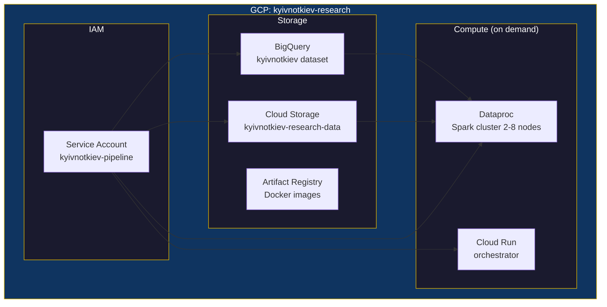

# Infrastructure

GCP infrastructure managed by Terraform. One command deploys everything.

## Resources



## BigQuery Tables

| Table | Partitioned | Clustered | Description |
|-------|------------|-----------|-------------|
| `raw_gdelt` | DAY (date) | pair_id, variant | News media mentions |
| `raw_common_crawl` | DAY (crawl_date) | pair_id, variant, domain | Web crawl matches |
| `raw_reddit` | MONTH (created_utc) | pair_id, variant, subreddit | Reddit posts/comments |
| `raw_wikipedia` | MONTH (date) | pair_id, variant | Pageviews + edits |
| `raw_trends` | — | pair_id, variant | Google Trends interest |
| `raw_ngrams` | — | pair_id, variant | Book frequency 1800-2019 |
| `raw_youtube` | MONTH (published_at) | pair_id, variant | Video metadata |
| `watermarks` | — | — | Ingestion state tracking |
| `analysis_adoption` | — | pair_id, source | Computed adoption ratios |
| `analysis_changepoints` | — | — | Detected change points |
| `v_cross_source` | — | — | View: cross-source comparison |
| `v_latest_adoption` | — | — | View: most recent ratios |

## Deploy

```bash
# First time: create state bucket manually
gcloud storage buckets create gs://kyivnotkiev-terraform-state --location=US

# Deploy
make infra

# Preview changes
make infra-plan

# Tear down
make infra-destroy
```

## Deferred Resources

Files ending in `.tf.deferred` are not deployed by default (cost control):

| File | Resource | When to enable |
|------|----------|---------------|
| `dataproc.tf.deferred` | Spark cluster (4-8 workers) | Before Common Crawl / Reddit bulk jobs |
| `cloud_run.tf.deferred` | Orchestrator service | After Docker image is built |

Rename to `.tf` and run `make infra` to deploy.

## Cost

| Resource | Monthly Cost |
|----------|-------------|
| BigQuery storage (~10GB) | ~$0.20 |
| BigQuery queries (free tier 1TB) | $0 |
| GCS storage (~200GB) | ~$4 |
| Dataproc (on-demand, ~4hrs) | ~$20-50 one-time |
| **Total steady-state** | **~$5/month** |
