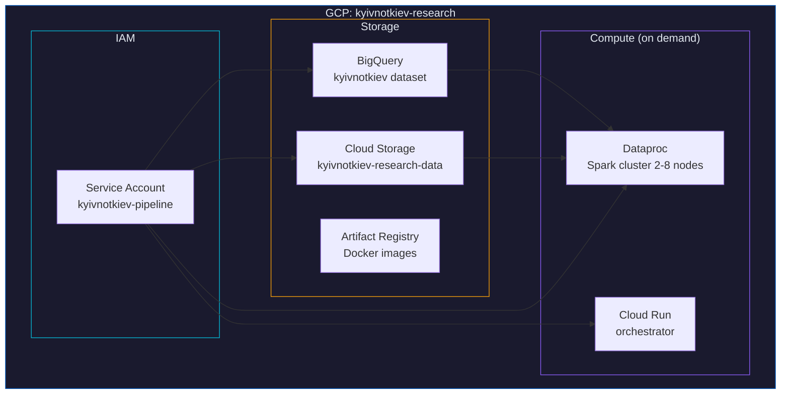

# Infrastructure

GCP infrastructure managed by Terraform. One command deploys everything.

## Resources



## BigQuery Tables

| Table | Partitioned | Clustered | Description |
|-------|------------|-----------|-------------|
| `raw_gdelt` | DAY (date) | pair_id, variant | News media mentions (39.6M) |
| `raw_reddit` | MONTH (created_utc) | pair_id, variant, subreddit | Reddit posts/comments (22K) |
| `raw_wikipedia` | MONTH (date) | pair_id, variant | Pageviews (573M) |
| `raw_trends` | -- | pair_id, variant | Google Trends interest (152K) |
| `raw_ngrams` | -- | pair_id, variant | Book frequency 1900--2019 (11.6K) |
| `raw_youtube` | MONTH (published_at) | pair_id, variant | Video metadata (14.5K) |
| `raw_openalex` | -- | pair_id, variant | Academic papers (379K) |
| `watermarks` | -- | -- | Ingestion state tracking |
| `analysis_adoption` | -- | pair_id, source | Computed adoption ratios |
| `analysis_changepoints` | -- | -- | Detected change points |
| `v_cross_source` | -- | -- | View: cross-source comparison |
| `v_latest_adoption` | -- | -- | View: most recent ratios |

## Deploy

```bash
make infra            # Deploy
make infra-plan       # Preview changes
make infra-destroy    # Tear down
```

## Deferred Resources

Files ending in `.tf.deferred` are not deployed by default (cost control):

| File | Resource | When to enable |
|------|----------|---------------|
| `dataproc.tf.deferred` | Spark cluster (4-8 workers) | Before Reddit bulk jobs |
| `cloud_run.tf.deferred` | Orchestrator service | After Docker image is built |

Rename to `.tf` and run `make infra` to deploy.

## Cost

| Resource | Monthly Cost |
|----------|-------------|
| BigQuery storage (~10GB) | ~$0.20 |
| BigQuery queries (free tier 1TB) | $0 |
| GCS storage (~200GB) | ~$4 |
| Dataproc (on-demand, ~4hrs) | ~$20-50 one-time |
| **Total steady-state** | **~$5/month** |

See also: [../README.md](../README.md) | [../pipeline/README.md](../pipeline/README.md)
