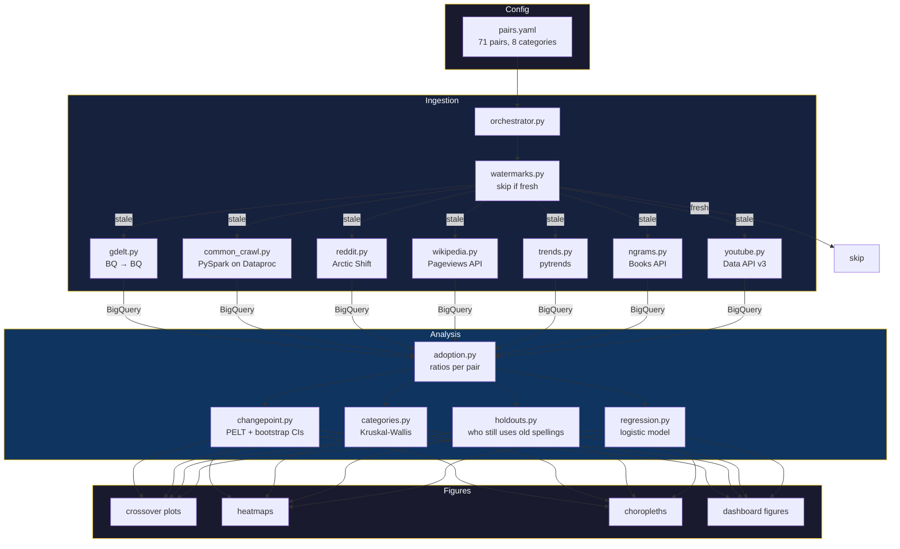

# Pipeline

Incremental data pipeline on GCP. Reads `config/pairs.yaml`, checks watermarks, fetches only what's new.

## Flow



## Modules

### `ingestion/`

| Module | Source | Scale | Method |
|--------|--------|-------|--------|
| `gdelt.py` | GDELT GKG | 42B articles | BQ public → BQ (SQL) |
| `common_crawl.py` | Common Crawl WARC | TB-scale | PySpark on Dataproc |
| `reddit.py` | Reddit via Arctic Shift | 50M+ comments | Spark on zst dumps |
| `wikipedia.py` | Wikimedia API | Pageviews + edits | REST API |
| `trends.py` | Google Trends | Weekly interest | pytrends |
| `ngrams.py` | Google Books | 1800–2019 | REST API |
| `youtube.py` | YouTube Data API v3 | Video metadata | REST API |
| `orchestrator.py` | — | — | Coordinates all above |
| `watermarks.py` | — | — | Tracks freshness per (pair, source) |

### `analysis/`

| Module | What | Statistical Method |
|--------|------|-------------------|
| `adoption.py` | Ukrainian spelling ratio over time | Count-based |
| `changepoint.py` | When did the shift happen? | PELT, bootstrap 95% CIs |
| `categories.py` | Do categories differ? | Kruskal-Wallis H, pairwise Mann-Whitney |
| `holdouts.py` | Who still uses old spellings? | Domain-level aggregation |
| `regression.py` | What predicts adoption speed? | Logistic regression |
| `events.py` | Impact of geopolitical events | Pre/post comparison |

### `figures/`

| Module | Output |
|--------|--------|
| `crossover.py` | Per-pair adoption curves with crossover dates |
| `heatmap.py` | All pairs × time heatmap |
| `choropleth.py` | Geographic adoption maps |
| `category_curves.py` | Category-level trend comparison |
| `event_overlay.py` | Event markers on timelines |
| `modern.py` | Publication-ready dashboard figures |

## Incremental Design

```
Pair added in pairs.yaml    → fetched across all 7 sources
Pair disabled               → excluded from analysis, data preserved in BQ
Pair already fresh          → skipped (watermark < 7 days old)
```

No data is ever deleted. Disabling a pair just filters it from analysis views.
