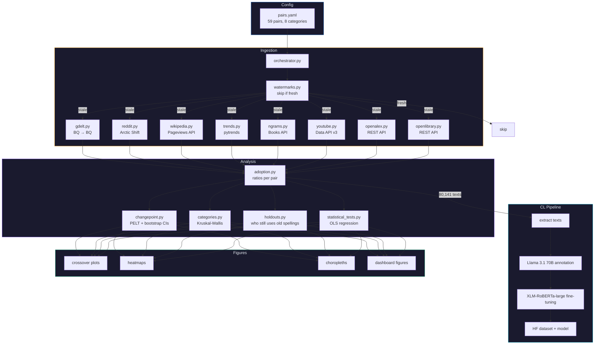

# Pipeline

Incremental data pipeline. Reads `config/pairs.yaml`, checks watermarks, fetches only what's new. Data published to HuggingFace.

## Flow

## Modules

### `ingestion/`

| Module | Source | Scale | Method |
|--------|--------|-------|--------|
| `gdelt.py` | GDELT GKG | 39.6M articles | BQ public dataset (SQL) |
| `reddit.py` | Reddit via Arctic Shift | 22.6K posts | Spark on zst dumps |
| `wikipedia.py` | Wikimedia API | 573M pageviews | REST API |
| `trends.py` | Google Trends | 151K datapoints | pytrends |
| `ngrams.py` | Google Books | 11.6K, 1900--2019 | REST API |
| `youtube.py` | YouTube Data API v3 | 14.5K videos | REST API |
| `openalex.py` | OpenAlex | 381K papers | REST API |
| `openlibrary.py` | Open Library | 1.9K titles | REST API |
| `orchestrator.py` | -- | -- | Coordinates all above |
| `watermarks.py` | -- | -- | Tracks freshness per (pair, source) |

### `cl/`

Transformer-based discourse analysis. See [cl/README.md](cl/README.md).

### `analysis/`

| Module | What | Statistical Method |
|--------|------|-------------------|
| `adoption.py` | Ukrainian spelling ratio over time | Count-based |
| `changepoint.py` | When did the shift happen? | PELT, bootstrap 95% CIs |
| `categories.py` | Do categories differ? | Kruskal-Wallis H, pairwise Mann-Whitney |
| `holdouts.py` | Who still uses old spellings? | Domain-level aggregation |
| `statistical_tests.py` | What predicts adoption speed? | OLS regression (nested models) |
| `events.py` | Impact of geopolitical events | Pre/post comparison |

### `figures/`

| Module | Output |
|--------|--------|
| `crossover.py` | Per-pair adoption curves with crossover dates |
| `heatmap.py` | All pairs x time heatmap |
| `choropleth.py` | Geographic adoption maps |
| `category_curves.py` | Category-level trend comparison |
| `event_overlay.py` | Event markers on timelines |
| `modern.py` | Publication-ready dashboard figures |

## Incremental Design

No data is ever deleted. Disabling a pair just filters it from analysis views.

- Pair added in `pairs.yaml` -> fetched across all 8 sources
- Pair disabled -> excluded from analysis, data preserved locally
- Pair already fresh -> skipped (watermark < 7 days old)

See also: [../README.md](../README.md) | [cl/README.md](cl/README.md) | [../infrastructure/README.md](../infrastructure/README.md)
