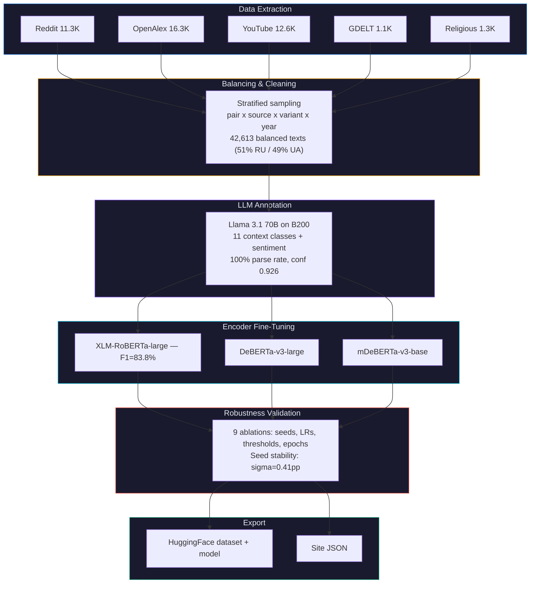

# Computational Linguistics Pipeline

**Transformer-based discourse analysis for Ukrainian toponym adoption**

This pipeline goes beyond counting Ukrainian vs Russian spelling forms -- it analyzes *what the text around each spelling actually says*, revealing that variant choice functions as a **discourse marker** signaling the writer's engagement context.

## Motivation

Binary regex matching tells us *whether* the world switched from "Kiev" to "Kyiv." But it can't explain *why* Chernobyl resists change at 5% adoption while Kyiv succeeded at 60%. The CL pipeline answers this:

| Spelling | Top collocations | Context |
|----------|-----------------|---------|
| "Chernobyl" (Russian) | accident, disaster, fukushima, hbo, nuclear | Disaster narrative, pop culture (HBO series), nuclear history |
| "Chornobyl" (Ukrainian) | accident, cleanup, clean, workers, disaster | Nuclear site operations, remediation, worker health |
| "Kiev" (Russian) | scenes, streets, dynamo, travel, chicken | Urban tourism, sports, food recipes |
| "Kyiv" (Ukrainian) | agglomeration, titled, mohyla, theological, biodiversity | Academic research, university life, institutional naming |

**The spelling doesn't just mark old vs new -- it marks which version of reality the writer engages with.**

## Architecture



## Key Findings

### 1. Context diverges by variant

| Context | Russian form | Ukrainian form | Difference |
|---------|-------------|----------------|-----------|
| History | 9.8% | 4.5% | **-5.3pp** -- Russian forms dominate historical discourse |
| Academic | 23.0% | 28.9% | **+5.9pp** -- Ukrainian forms growing in academic papers |
| Sports | 4.7% | 8.0% | **+3.3pp** -- post-UEFA rename effect |
| War | 22.1% | 24.4% | +2.3pp -- conflict-aware writing uses Ukrainian forms |
| Food | 4.1% | 3.5% | -0.6pp -- recipe names resist change equally |

### 2. Sentiment differs

| Context | Russian form | Ukrainian form |
|---------|-------------|----------------|
| War & Conflict | -0.48 | -0.44 (less negative -- resilience framing) |
| Food & Cuisine | +0.65 | +0.68 (positive regardless) |
| Politics | -0.19 | -0.15 |

### 3. Encoder benchmark

| Model | Parameters | F1 (macro) | Accuracy |
|-------|-----------|------------|----------|
| **XLM-RoBERTa-large** | 550M | **83.8%** | — |
| DeBERTa-v3-large | 304M | — | — |
| mDeBERTa-v3-base | 86M | — | — |

### 4. Robustness — 9 experiments (DeBERTa-v3-large)

| Experiment | Seed | LR | Conf | Epochs | Acc | F1 |
|-----------|------|-----|------|--------|-----|-----|
| seed_42 | 42 | 2e-5 | 0.6 | 3 | 89.3% | 87.5% |
| seed_123 | 123 | 2e-5 | 0.6 | 3 | 89.6% | 87.4% |
| seed_456 | 456 | 2e-5 | 0.6 | 3 | 90.0% | 88.2% |
| **lr_1e-5** | 42 | **1e-5** | 0.6 | 3 | **90.1%** | **88.8%** |
| lr_3e-5 | 42 | 3e-5 | 0.6 | 3 | 89.3% | 87.2% |
| conf_0.5 | 42 | 2e-5 | 0.5 | 3 | 89.7% | 87.8% |
| conf_0.8 | 42 | 2e-5 | 0.8 | 3 | 89.6% | 87.4% |
| epochs_5 | 42 | 2e-5 | 0.6 | 5 | 89.2% | 87.3% |
| epochs_7 | 42 | 2e-5 | 0.6 | 7 | 89.4% | 87.7% |

**Conclusions:** Seed stability σ=0.41pp (sample std, n=3). LR=1e-5 optimal (+1.6pp over 3e-5). Confidence threshold barely matters. 3 epochs optimal (5 and 7 overfit).

## Mathematical Details

### NPMI (Normalized Pointwise Mutual Information)

For collocation extraction, we use NPMI to rank co-occurring words:

```
PMI(w, target) = log2 P(w, target) / (P(w) * P(target))

NPMI(w, target) = PMI(w, target) / -log2 P(w, target)
```

NPMI normalizes to [-1, 1], preventing rare words from ranking artificially high. We set `MIN_FREQ = 20` and filter to English-script texts to eliminate hashtags, usernames, and URL fragments.

### Context Classification

11-class multi-class classification via cross-entropy loss:

```
L = -sum_i y_i log(softmax(Wx + b)_i)
```

Where `x` is the `[CLS]` token representation from the encoder (1024-dim for XLM-RoBERTa-large), `W in R^(11x1024)`, and `y` is the one-hot label from Llama annotation.

### Training Configuration

| Parameter | Value |
|-----------|-------|
| Optimizer | AdamW (beta1=0.9, beta2=0.999, eps=1e-8) |
| Learning rate | 2e-5 (default; 1e-5 optimal in robustness grid) |
| Warmup | 10% of total steps |
| Weight decay | 0.01 |
| Batch size | 16 train / 32 eval |
| Max sequence length | 512 tokens |
| Precision | fp16 |
| Epochs | 3 (validated: 5 and 7 epochs show overfitting) |
| Label confidence filter | >= 0.5 |
| Train/val/test split | 80/10/10 stratified |

## Usage

```bash
make cl-extract              # Extract texts (Reddit + YouTube + OpenAlex)
make cl-gdelt                # Fetch GDELT article bodies (async, ~30 min)
make cl-balance              # Stratified sampling
make cl-classify API_URL=... # LLM annotation (requires vLLM server)
make cl-finetune             # Train 3 encoders
make cl-export               # Export to HF + site JSON
make cl-all                  # Full pipeline end-to-end
```

## Dataset

| Source | Texts | Domain | Content |
|--------|-------|--------|---------|
| OpenAlex | 16,323 | Academic | Paper titles + reconstructed abstracts |
| YouTube | 12,622 | Video | Titles + descriptions |
| Reddit | 11,341 | Social media | Titles + comment bodies |
| Religious | 1,256 | Institutional | Religious organization web content |
| GDELT | 1,071 | News | Article bodies via trafilatura |
| **Total** | **42,613** | | |

## Hardware

| Task | Wall time | Cost |
|------|-----------|------|
| Instance setup (boot, deps, model download, warmup) | ~25 min | — |
| Llama 70B annotation (42,613 texts, 16 concurrent) | 45 min | — |
| 3-model encoder benchmark (DeBERTa, XLM-R, mDeBERTa) | 25 min | — |
| 9 robustness experiments (seeds, LRs, thresholds, epochs) | 2.5 hrs | — |
| **Total (NVIDIA B200 183GB, vast.ai)** | **~4.5 hrs** | **$14.10** |

See also: [../README.md](../README.md) | [../../README.md](../../README.md)
