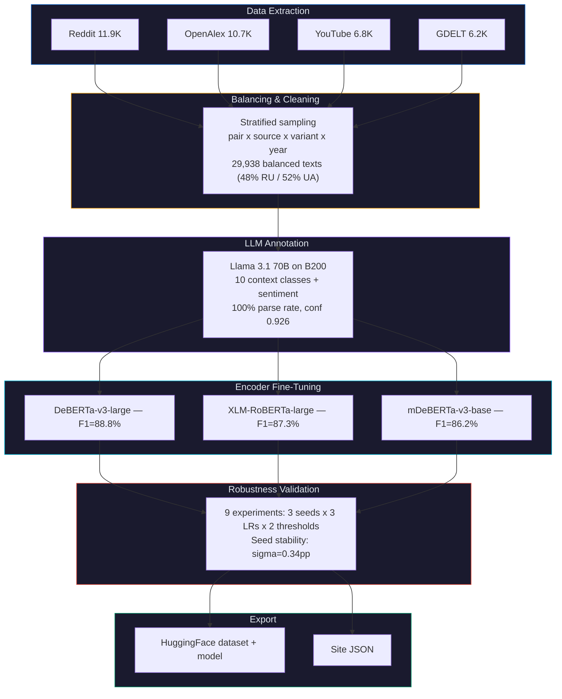

# Computational Linguistics Pipeline

**Transformer-based discourse analysis for Ukrainian toponym adoption**

This pipeline goes beyond counting Ukrainian vs Russian spelling forms -- it analyzes *what the text around each spelling actually says*, revealing that variant choice functions as a **discourse marker** signaling the writer's engagement context.

## Motivation

Binary regex matching tells us *whether* the world switched from "Kiev" to "Kyiv." But it can't explain *why* Chernobyl resists change at 5% adoption while Kyiv succeeded at 60%. The CL pipeline answers this:

| Spelling | Top collocations | Context |
|----------|-----------------|---------|
| "Chernobyl" (Russian) | disaster, hbo, nuclear, simulator, fukushima | Pop culture, gaming, tourism -- the disaster as entertainment brand |
| "Chornobyl" (Ukrainian) | cleanup, accident, exclusion, heart, zone | Actual nuclear site operations, IAEA, radiation biology |
| "Kiev" (Russian) | streets, chicken, guide, pronunciation, travel | Food recipes, tourism guides, language how-tos |
| "Kyiv" (Ukrainian) | dynamo, walk, barcelona, champions, uefa | Football (Dynamo Kyiv), travel vlogs, modern city life |

**The spelling doesn't just mark old vs new -- it marks which version of reality the writer engages with.**

## Architecture



## Key Findings

### 1. Context diverges by variant

| Context | Russian form | Ukrainian form | Difference |
|---------|-------------|----------------|-----------|
| History | 9.8% | 4.5% | **-5.3pp** -- Russian forms dominate historical discourse |
| Academic | 23.0% | 28.9% | **+5.9pp** -- Ukrainian forms growing in academic papers |
| Sports | 4.7% | 8.0% | **+3.3pp** -- post-UEFA rename effect |
| War | 22.1% | 24.4% | +2.3pp -- conflict-aware writing uses Ukrainian forms |
| Food | 4.1% | 3.5% | -0.6pp -- recipe names resist change equally |

### 2. Sentiment differs

| Context | Russian form | Ukrainian form |
|---------|-------------|----------------|
| War & Conflict | -0.48 | -0.44 (less negative -- resilience framing) |
| Food & Cuisine | +0.65 | +0.68 (positive regardless) |
| Politics | -0.19 | -0.15 |

### 3. Encoder benchmark

| Model | Parameters | F1 (macro) | Accuracy |
|-------|-----------|------------|----------|
| **DeBERTa-v3-large** | 304M | **88.8%** | **90.1%** |
| XLM-RoBERTa-large | 550M | 87.3% | 89.4% |
| mDeBERTa-v3-base | 86M | 86.2% | 88.7% |

### 4. Robustness (DeBERTa-v3-large)

| Variation | F1 range | Conclusion |
|-----------|----------|-----------|
| 3 random seeds | 87.4--88.2% (sigma=0.34pp) | Stable across initialization |
| Learning rate 1e-5 to 3e-5 | 87.2--88.8% | LR=1e-5 optimal |
| Confidence threshold 0.5 to 0.8 | 87.4--87.8% | Labels robust to filtering |

## Mathematical Details

### NPMI (Normalized Pointwise Mutual Information)

For collocation extraction, we use NPMI to rank co-occurring words:

```
PMI(w, target) = log2 P(w, target) / (P(w) * P(target))

NPMI(w, target) = PMI(w, target) / -log2 P(w, target)
```

NPMI normalizes to [-1, 1], preventing rare words from ranking artificially high. We set `MIN_FREQ = 20` and filter to English-script texts to eliminate hashtags, usernames, and URL fragments.

### Context Classification

10-class multi-class classification via cross-entropy loss:

```
L = -sum_i y_i log(softmax(Wx + b)_i)
```

Where `x` is the `[CLS]` token representation from the encoder (1024-dim for DeBERTa-large), `W in R^(10x1024)`, and `y` is the one-hot label from Llama annotation.

### Training Configuration

| Parameter | Value |
|-----------|-------|
| Optimizer | AdamW (beta1=0.9, beta2=0.999, eps=1e-8) |
| Learning rate | 1e-5 (validated via grid search) |
| Warmup | 10% of total steps |
| Weight decay | 0.01 |
| Batch size | 16 train / 32 eval |
| Max sequence length | 512 tokens |
| Precision | BF16 |
| Epochs | 3 (validated: 5 and 7 epochs show overfitting) |
| Label confidence filter | >= 0.6 |
| Train/val/test split | 80/10/10 stratified |

## Usage

```bash
make cl-extract              # Extract texts from BQ (Reddit + YouTube + OpenAlex)
make cl-gdelt                # Fetch GDELT article bodies (async, ~30 min)
make cl-balance              # Stratified sampling
make cl-classify API_URL=... # LLM annotation (requires vLLM server)
make cl-finetune             # Train 3 encoders
make cl-export               # Export to HF + site JSON
make cl-all                  # Full pipeline end-to-end
```

## Dataset

| Source | Texts | Domain | Content |
|--------|-------|--------|---------|
| Reddit | 11,886 | Social media | Titles + comment bodies |
| OpenAlex | 10,687 | Academic | Paper titles + reconstructed abstracts |
| YouTube | 6,835 | Video | Titles + descriptions |
| GDELT | 6,237 | News | Article bodies via trafilatura (58% fetch yield) |
| **Total** | **35,645** | | **29,938 after balancing** |

## Hardware

| Task | Wall time | Cost @ $3.33/hr |
|------|-----------|-----------------|
| Instance setup (boot, deps, model download, warmup) | ~25 min | $1.39 |
| Llama 70B annotation (29,938 texts, 16 concurrent) | 45 min | $2.50 |
| 3-model encoder benchmark (DeBERTa, XLM-R, mDeBERTa) | 25 min | $1.39 |
| 9 robustness experiments (seeds, LRs, thresholds, epochs) | 2.5 hrs | $8.33 |
| Idle / downloads between tasks | ~15 min | $0.83 |
| **Total** | **~4.5 hrs** | **~$15** |

See also: [../README.md](../README.md) | [../../README.md](../../README.md)
